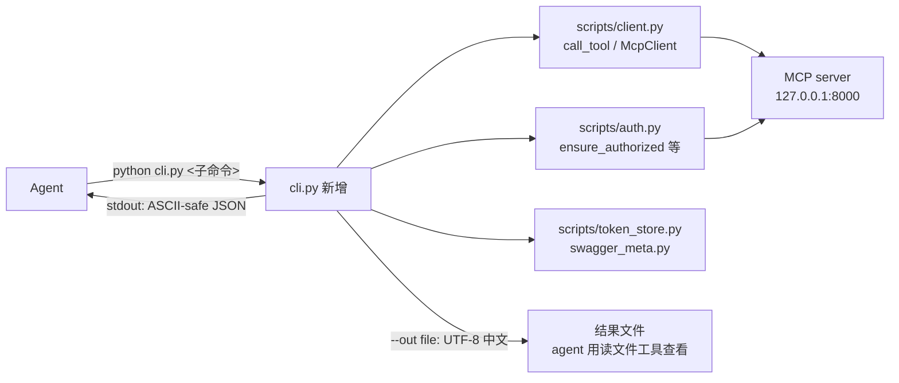

# iwp-skill CLI 化改造 — 方案设计

> **实现状态**: ✅ 已实施并验证（`cli.py` 子命令与 §4.2 清单一致；输出契约/退出码见 `cli.py` `_emit`）
> **最后更新**: 2026-09-23（原状态「进入阶段三执行」已过时，实施完成后更新）
> 日期：2026-09-22
> 原状态：已确认（阶段二产出，进入阶段三执行）
> 背景：技能指导文档原先要求 agent 现场写 python 片段调 `scripts.client.call_tool()`，实测导致大量即兴组装（临时脚本、输出乱码落盘重试、返回结构猜测）。本方案将调用路径收敛为单一 CLI 入口。
> 勘误补充（2026-09-23）：v1.1.0 起技能另有 update 路由与 `scripts/update.ps1` 无损更新脚本，属技能分发机制，不在本方案 cli.py 子命令范围内。

## 一、问题与证据（来自 2026-09-22 会话实测）

- 参考文件 6 个中散布 37 处 python 代码块/调用点；授权流程要求 agent 手写临时脚本
- 历史会话残留临时脚本 6 个（`.tmp_create_task.py` 等），证明"agent 现写脚本"是稳定模式
- 本次会话 9 次工具调用中 6 轮浪费源于：临时脚本编写、输出 GBK 乱码落盘重试、返回结构猜测（`data.items/list` 实为顶层 `tasks`）、状态码语义查证

## 二、已确认的三项决策

| 决策点 | 结论 |
|--------|------|
| CLI 形态 | 薄透传内核（`call`/`tools`/`selfcheck`）+ 高频场景子命令（`auth` 四命令、`tasks list`） |
| 输出契约 | stdout 默认 ASCII-safe JSON（`ensure_ascii=True`）；`--out FILE` 写 UTF-8 中文文件 |
| 旧路径去留 | 参考文件 python 片段全量迁移为 CLI 命令；`scripts/` 函数库降级为 cli.py 内部依赖，接口零改动 |

## 三、整体架构

- **数据流**：Agent 一条命令 → cli.py 组装 → 复用现有 client/auth 函数库 → MCP server；结果按输出契约返回 Agent
- **模块边界**：cli.py 只做「参数解析、命令编排、输出契约、退出码」四件事；不复制任何协议/业务逻辑，全部委托 `scripts/` 现有函数；文档从"教 agent 写 python"变为"教 agent 拼命令"

## 四、核心模块设计

### 4.1 输出契约（cli.py 内 `_emit` 统一出口）

- stdout：`json.dumps(ensure_ascii=True)`——纯 ASCII，任何管道编码下不乱码、无损
- `--out FILE`：UTF-8 + `ensure_ascii=False` 写文件（保留中文可读）
- 成功：`{"ok": true, ...}` + 退出码 0；错误：`{"ok": false, "error": {"kind", "message", "hint"}}` + 退出码 1；用法错误退出码 2
- 绝不打印 token/verifier 等凭证明文，只回执 `user_id`、`expires_in` 等摘要

### 4.2 子命令清单

| 子命令 | 包装的现有函数 | 说明 |
|--------|---------------|------|
| `call <tool> [--args JSON \| --args-file F] [--out F]` | `client.call_tool` | 万能透传，覆盖 free-mode 及未来新工具；`--args-file` 规避 bash 内联转码坑 |
| `tools [--refresh] [--out F]` | `swagger_meta.load_or_refresh(client)` | schema 优先发现入口：工具名+描述+inputSchema |
| `auth status` | `token_store.load + is_access_token_valid` | 授权态检查（铁律第一步） |
| `auth start` | `auth.ensure_authorized`（捕获 RuntimeError） | 打印 authorize_url + state，写 `.oauth_next_step.json`，起本地回调 server；已授权时直接报告 |
| `auth finish [--code CODE] [--timeout N]` | `auth.poll_callback_result + finalize_authorization` | 轮询回调→校验 state→换 token→清理中间产物；`--code` 支持手动注入 code（恢复路径） |
| `auth invalidate` | `token_store.invalidate` | 重新授权前作废旧凭证 |
| `tasks list --mine [--status S] [--all] [--page N --size N] [--out F]` | `call_tool("list_my_tasks"/"list_tasks")` | `--all` 自动翻页合并；归一化顶层 `items/total/page`（兼容 server 键名 `tasks/list/items` 漂移）；每条附 `status_label` |
| `selfcheck` | `scripts.protocol_selfcheck` | 连通性/协商诊断 |

状态标签映射（0-未开始/1-进行中/2-已完成/3-暂停）作为渲染知识集中放 cli.py 一处。

### 4.3 退出码

0 成功；1 业务/协议错误（stdout 带错误 JSON）；2 用法错误。

## 五、关键逻辑

- **auth 流程与 agent 分工不变**：`auth start` 输出 URL → agent 用 ask_user 展示（授权铁律保留）→ 用户浏览器确认 → `auth finish` 一步完成"轮询+state 校验+换 token+清理"
- **tasks list 归一化**：键名差异消化在 CLI 内；透传 `call` 保持原样返回（schema 优先、零加工）
- **文档迁移原则**：工作流顺序、确认规则、错误处置表全部保留，仅把代码块替换为等价 CLI 命令
- **cwd 无关**：cli.py 内部路径全部基于 `skill_config.SKILL_DIR` 定位；文档约定 `cd` 到技能目录后执行

## 六、边界情况处理

| 场景 | 处理方式 |
|------|----------|
| `--args` 内联 JSON 被 bash 转码 | 文档指导参数含中文/复杂结构时用 `--args-file`；非法 JSON 报 kind=`usage` |
| 回调端口 9999 被占用 | 沿用 `ensure_authorized` 显式报错（含占用进程信息），不换端口硬试 |
| state 不一致 / 用户拒绝授权 | `auth finish` 非零退出 + 错误 JSON；agent 按语义终止，不重试 |
| 401 / refresh 失效 | client 自动续期重试 1 次后仍失败 → kind=`auth_expired`，hint="auth invalidate && auth start" |
| 421 / server 未启动 | 错误透传 + hint 指向 selfcheck 与服务端 MCP_ALLOWED_HOSTS 检查 |
| 分页超过 server 上限 | `--all` 按 `page_size` 上限逐页拉取直到取满 `total`，页间 0.2s 间隔 |
| MCP server 返回结构漂移 | 场景命令在 CLI 内归一化；透传 `call` 原样返回 |

## 七、涉及文件清单

| 文件 | 修改类型 | 说明 |
|------|----------|------|
| `cli.py`（技能根目录） | 新增 | 全部子命令 + 输出契约 + 退出码 |
| `SKILL.md` | 修改 | 调用约定改 CLI 入口；授权铁律指向 auth 子命令 |
| `references/_shared/tool-discovery.md` | 修改 | §1/§2 示例 → `cli.py call` / `cli.py tools` |
| `references/_shared/auth-flow.md` | 修改 | 五步流程 → `auth status/start/finish` 命令序列 |
| `references/_shared/failure-modes.md` | 修改 | 错误处置改 CLI 退出码/错误 JSON 口径 |
| `references/tasks/README.md` | 修改 | W1-W4 python 块 → CLI 命令 |
| `references/reports/README.md` | 修改 | 周报工作流 python 块 → CLI 命令 |
| `references/free-mode/README.md` | 修改 | 透传示例 → `cli.py call` |
| `.tmp_create_task.py`、`.tmp_run_oauth.py`、`scripts/zztmp_step1_start.py`、`scripts/zztmp_probe_tls.py`、`scripts/zztmp_probe_mcp.py`、`scripts/zztmp_check_auth.py` | 删除 | 历史会话残留临时脚本 |
| `scripts/client.py` / `auth.py` / `token_store.py` / `swagger_meta.py` | 不动 | 降级为 cli.py 内部依赖，接口零改动 |

## 八、预期收益（对照 2026-09-22 会话）

- 授权：5+ 轮（写 2 个临时脚本 + 猜结构修正）→ 2 条命令
- 查询任务：5 轮（含乱码落盘、结构探针）→ 1 条命令
- 新工具调用：1 条 `call` 命令，零成本接入
- 准确性：文档单一口径 + CLI 本地参数校验，即兴组装面归零
