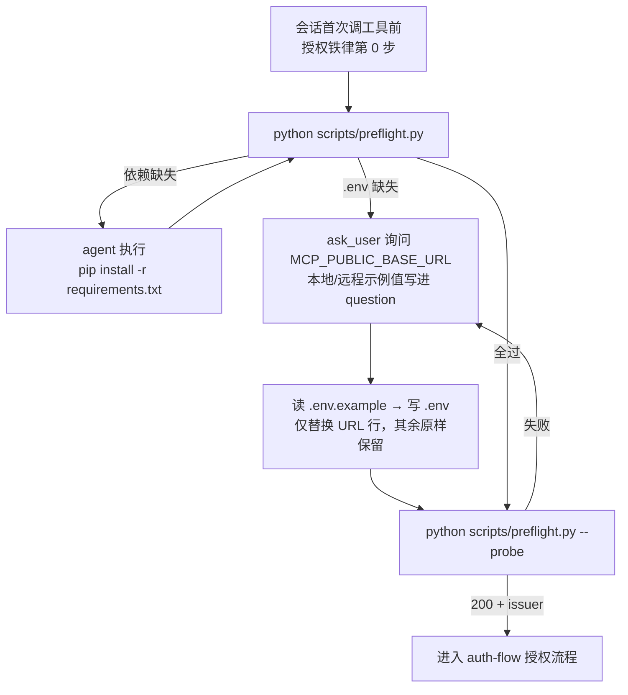

# 事前检查与配置引导 - 方案设计

> 日期：2026-09-23　状态：已确认（阶段二用户确认通过）
> 对应 ADR-013（docs/architecture.md）

## 1. 背景与问题

skills CLI 安装的技能副本是"裸"目录：无 `.env`、无凭证。现状下首次使用有两个静默失败点：

- `.env` 缺失 → `skill_config.py` 静默回退内置默认值（`http://127.0.0.1:8000` 等），agent 对默认地址发起注定失败的 OAuth，报错信息（"MCP server 不可达"）对用户无指导性
- 依赖缺失 → `cli.py` 顶层导入 httpx 依赖链，启动即裸 traceback（非 JSON 契约），与业务错误混淆

技能文档无任何首启/配置引导环节；README 声称"依赖 skill 自动管理"但代码无对应逻辑。

## 2. 需求结论（阶段一确认）

- 会话首次调工具前，**同一个脚本**完成两类事前检查：`.env` 存在性（仅存在性，不做 KEY 校验——创建路径固定为 agent 复制 `.env.example` 改 URL，不存在"半截 .env"）+ 依赖可导入性（python/httpx/cryptography，requirements.txt 全集）
- `.env` 缺失 → agent 用 ask_user 询问 `MCP_PUBLIC_BASE_URL`，以 `.env.example` 为底稿创建（仅替换 URL，其余保留默认）
- 依赖缺失 → agent 自动执行 `pip install -r requirements.txt`，装完重跑检查复核
- `.env` 写入后验证 MCP server 可达性，通过后再进入授权流程
- 一并修正 README 漂移：删除代码中不存在的 `IWP_FRONTEND_BASE_URL` 行

## 3. 逻辑方案

### 3.1 检查脚本 `scripts/preflight.py`（仅标准库，独立入口）

| 项 | 设计 | 依据 |
|---|---|---|
| 入口形态 | `python scripts/preflight.py`，不做成 cli.py 子命令 | `cli.py:39-40` 顶层导入 httpx 依赖链，缺依赖时 cli.py 在 argparse 前即崩；独立脚本绕开该约束，cli.py 零改动 |
| 检查项 | ① `httpx`/`cryptography` 可导入性（`importlib.util.find_spec`，不真实导入）；② `SKILL_DIR/.env` 存在性 | 阶段一裁定：检查深度=存在性 |
| `--probe` 模式 | 读 `skill_config.MCP_PUBLIC_BASE_URL`，urllib GET `/.well-known/oauth-authorization-server`（未认证） | `cli.py selfcheck` 需要本地 token（protocol_selfcheck.py:33-36），未授权场景不可用；well-known 是无凭证探测点，且 issuer 字段可提前暴露服务端配置错位 |
| 输出契约 | stdout ASCII-safe JSON `{"ok", "checks", "hints"}`；全过退出码 0，有缺失退出码 1 | 与 cli.py 输出契约一致 |
| 可导入性 | 仅标准库 + `skill_config`（后者仅依赖 pathlib） | 不拉起 httpx 链 |

### 3.2 工作流文档 `references/_shared/setup-flow.md`（setup 流程唯一事实来源）

完成判据（全部可检验）：依赖安装后 preflight `deps` 全 ok；`.env` 写入后 `env_present: true`；probe 返回 200 + issuer 字段。probe 失败 = URL 错或服务未启动，回到询问 URL 步骤，不进入授权。

### 3.3 既有文件接入（指针化，不复制流程）

| 文件 | 改动 |
|---|---|
| `SKILL.md` | 授权铁律加第 0 步一句话 + 指向 setup-flow.md；路由表加「首次使用/配置 → setup → 维护」行，与 update 行同构 |
| `auth-flow.md` | §1 前置加一行指针 |
| `update-flow.md` | 加一行：更新后 `.env` 丢失/恢复失败时重新进入 setup-flow（skills CLI 直接更新 rm -rf 技能目录，setup 高频触发场景） |
| `README.md` | §2 依赖表述改为与实际一致（事前检查自动安装）；§3 配置节改为 agent 引导说明；删除 `IWP_FRONTEND_BASE_URL` 陈旧行 |
| `cli.py` / `skill_config.py` / `.env.example` | 不改动 |

## 4. 规则与边界

- 触发时机：会话**首次**调工具前跑一次（授权铁律检查门），非每次调用；preflight 全过即幂等直通授权
- `.env` 创建路径唯一：agent 复制 `.env.example` 改 URL；用户手改残缺 `.env` 不在防御范围（阶段一裁定）
- probe 失败归 setup-flow；授权后才出现的连接/错误归 failure-modes——两流程以「是否已过 probe」分界
- 依赖安装目标 = requirements.txt 固定清单，agent 无自由发挥；装完必须重跑 preflight 复核

## 5. 风险与兼容性

- `find_spec` 只证明"装了"，不证明"版本兼容"——requirements.txt 已声明最低版本，实际导入失败会在后续 CLI 调用暴露，可接受残留
- pip 安装改变用户 Python 环境（阶段一已确认接受）
- 老用户已有 `.env`：preflight 直通，行为零变化

## 6. 验证口径

| 验证项 | 方法 |
|---|---|
| preflight 基础检查 | 正常环境跑 → 全 ok；临时改名 `.env` 重跑 → `env_present:false` + 退出码 1 |
| 依赖缺失分支 | 模拟缺 httpx → hints 指引正确；安装后恢复 |
| `--probe` | 对真实 server 跑 → 200+issuer；对错误端口跑 → 失败且 hints 正确 |
| 端到端 | 删除 `.env` + 凭证副本模拟新装 → 走完 setup→授权→调一个工具全链路 |
| 文档一致性 | 全分支指针触达核对（SKILL.md / auth-flow / update-flow / README），`.env.example` 与 README 无漂移 |

## 7. writing-great-skills 校验结论

- 单一事实来源：setup 流程步骤只住 setup-flow.md，SKILL.md/auth-flow/update-flow 只放一行指针，README 不承载 agent 步骤
- 全分支指针触达：deps 缺失/env 缺失/probe 失败三分支在 setup-flow 内闭合；update 后丢 `.env` 场景经 update-flow 指针可达
- 每步可检验完成判据，防 premature completion
- 正向表述：按"通过→下一步"组织
- 渐进披露：授权铁律第 0 步压到一句话，细节全在指针后
