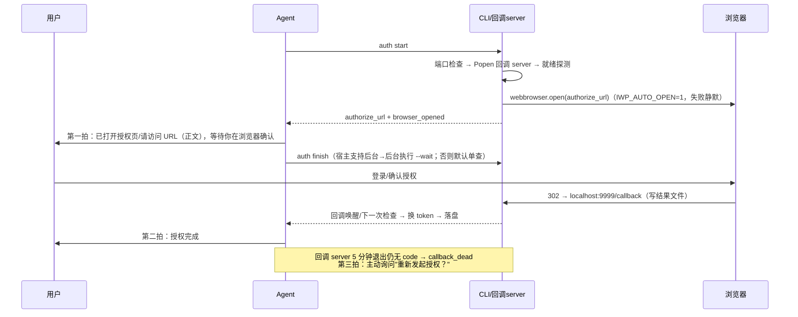
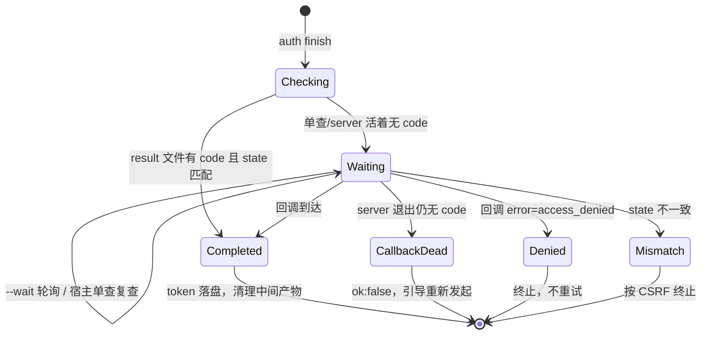
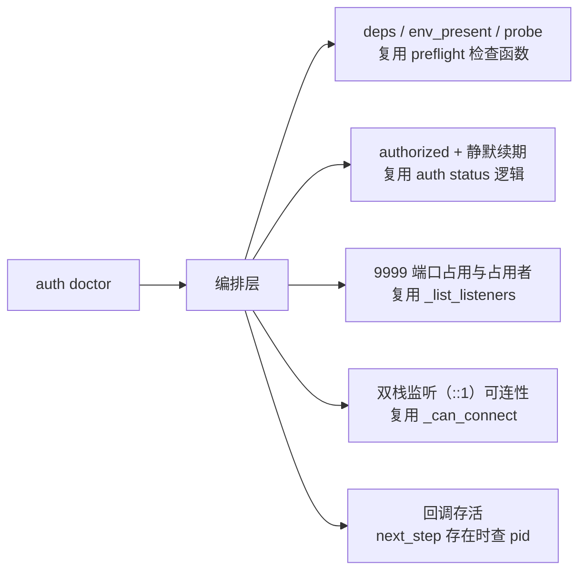

# 回声授权（Echo Auth）- 方案设计

> 阶段二逻辑方案。历史增量方案文档；本轮落地后不回写，后续演进另立新档。
> 需求结论依据：阶段一 v3（2026-09-24 用户确认）。

## 一、命名

**回声授权（Echo Auth）**。取义：授权链路的每一步都有回声——发起有回声（自动打开授权页 + 一拍播报）、回调有回声（到达即自动推进，无需用户口头确认）、中断有回声（回调服务退出时主动询问是否重新发起）、诊断有回声（一条命令出完整体检报告）。

## 二、设计目标

| 目标 | 现状痛点 | 目标态 |
|------|---------|--------|
| 授权零对话往返 | 文档要求 agent 等用户回复"授权完成"才推进 | 回调到达即自动推进；仅超时/失败时才需要用户回应 |
| 等待不黑盒 | 展示 URL 后用户不知道 agent 在等还是卡死 | 两拍播报：发起一拍、完成一拍、失败追加一拍 |
| 过期不撞墙 | 回调 server 5 分钟后自然退出，用户晚确认撞"拒绝连接" | 结构化检出 callback_dead，主动询问重新发起 |
| 排障一条命令 | 诊断分散在 preflight/selfcheck/status/手工查端口 | `auth doctor` 聚合体检，编排复用既有检查 |
| 省复制粘贴 | 手动复制 URL 到浏览器 | `auth start` 默认自动打开浏览器（可配开关），失败静默降级 |

## 三、真实现状（已核实）

| 事实 | 证据 |
|------|------|
| finish 阻塞轮询 300s，宿主 shell 前台超时更短即被掐死 | `cli.py:246`、`auth.py:628-648`、`auth.py:13` |
| 回调到达自动写结果文件；"要用户说完成"纯系文档约束 | `auth.py:193-206`；`user-interaction.md:17`、`auth-flow.md:26` |
| 回调 server 寿命 5 分钟（从 start 起）；授权事务 5 分钟（从打开 URL 起） | `auth.py:582-592`、服务端 `authorize.py:99-112`、`transactions.py:25` |
| MCP refresh_token 7 天滚动；Web 登出/被踢立即断链 | 服务端 `config.py:73`、`token.py:291`、`exceptions.py:51-59` |
| ipv6 降级仅写日志；无自动开浏览器逻辑；成功页文案"agent 将自动继续" | `auth.py:296-298`、`auth.py:180-185` |
| `_saved_at` 已入缓存；`IWP_REFRESH_TOKEN_TTL_S` 为从未引用的死常量 | `token_store.py:74`、`skill_config.py:96` |

## 四、逻辑方案

### 4.1 授权主流程（目标态时序）

### 4.2 finish 状态契约

返回契约（CLI JSON）：

| status / kind | ok | 退出码 | 语义 |
|---------------|----|--------|------|
| `completed`（附 user_id/expires_at） | true | 0 | 授权完成 |
| `waiting`（附 elapsed_s、callback_alive:true） | true | 0 | 查询本身成功；非终态。宿主按能力决定后台等待或稍后复查 |
| kind=`callback_dead`（附 elapsed_s） | false | 1 | 回调服务已退出仍无 code → 主动询问重新发起 |
| kind=`callback_timeout`（仅 --wait 超时） | false | 1 | 等待到达上限，server 可能仍活着 |
| kind=`auth_denied` / `state_mismatch` / `auth_flow` | false | 1 | 语义与现状一致 |

默认行为（无 `--wait`）= 单查一次立即返回；`--wait N` = 阻塞轮询 N 秒（兼容旧行为，也是后台唤醒场景的实现载体）。

### 4.3 doctor 体检组成（编排复用，不复制实现）

- 输出：`{"ok":…, "checks":[{name, ok, detail}…], "summary"}`；只诊断不修复
- 单一诊断入口：failure-modes 的诊断指引只指向 doctor
- 检查项均为只读编排，禁止在 doctor 内重写 probe/status/端口检查的实现

### 4.4 配置面

| KEY | 默认 | 说明 |
|-----|------|------|
| `IWP_AUTO_OPEN` | `1` | auth start 是否自动打开浏览器；`0` 关闭回退纯 URL 呈现 |
| 删除 `IWP_REFRESH_TOKEN_TTL_S` | — | 死常量，从未引用；注释含错误事实（"30 天"） |
| `TOKEN_KEY_TTL_S` 注释修正 | — | 删除"refresh_token TTL 对齐"错误表述（真实为 7 天滚动） |

## 五、文档层修改设计（writing-great-skills 校验后）

SSOT 判定：本节列出全部"一个含义一个住所"的编辑点；以下均不改动写操作语义。

| 住所 | 修改 | 校验要点 |
|------|------|---------|
| `user-interaction.md` §1 判据 3 | 授权与写操作拆分：写操作保持"已获得用户明确回应"；授权改为"以回调到达为准，不以用户口头确认为准；回调未到或失败时按 failure-modes 引导" | 动作+指针形态，不复述呈现 how |
| `auth-flow.md` 第 2 步 | 改为"展示 authorize_url 后立即进入等待（按 user-interaction.md 呈现；推进以回调为准）"；补一句宿主分层：支持后台则后台等待，否则单查复查 | 意图层措辞，不绑定宿主机制 |
| `auth-flow.md` 第 4 步 + 时序表 | finish 语义更新（waiting/callback_dead/completed）；时序表补 callback_dead 行与"重新发起"指针 | 指向 failure-modes，不就地展开处置步骤 |
| `failure-modes.md` | 新增 callback_dead 处置（主动询问"重新发起授权？"→ 同意则 auth start 重走）；断链原因分类表（refresh grant 失败=7 天滚动窗断；工具调用期 IwpCredentialExpiredError=Web 登出/被踢/30 天链断）；诊断指引统一指向 doctor | 唯一处置住所 |
| `auth.py` 成功页文案 | "授权成功——回到对话即可，无需其他操作。"（替换"可关闭此窗口返回终端/agent 将自动继续"） | 文案唯一住所即代码 |
| 两拍播报 | 写入 auth-flow 意图层（发起一拍/完成一拍/callback_dead 第三拍） | 不进 user-interaction.md（那是呈现 how 的住所，播报时机是流程语义） |

判定为不修改：`setup-flow.md`（仅引用 auth-flow，无语义变化）、`SKILL.md`（指针标签仍准确）、`tasks/README.md`、历史 docs 方案文档。

## 六、规则与边界

1. **推进判据（硬规则）**：授权完成的唯一判据是回调 code + state 校验通过并换得 token；用户口头"好了"只作为宿主单查模式下触发复查的信号，永不作为推进依据。
2. **waiting 不可区分性**：客户端无法区分"未打开 URL"与"停在确认页"（事务过期瞬间不可检），一律归 waiting；事务过期的用户侧表现由 SPA 报错承担，技能侧由 callback_dead 检出兜底。
3. **A3 时序铁律**：自动打开浏览器必须发生在回调端口就绪探测通过之后；弹窗失败静默降级且 `browser_opened:false` 返回；URL 正文呈现不因弹窗成功而豁免。
4. **弹窗前提**：仅全新授权路径弹窗；`already_authorized` 分支（现状先行短路）不弹窗。
5. **finish 行为变更性质**：默认单查是行为变更，旧阻塞语义由 `--wait` 等价承接；CLI 非对外契约，随文档同步即无外部破坏面。
6. **denied/mismatch 语义不变**：按拒绝/CSRF 终止，不重试。
7. **server 寿命维持 5 分钟**：前提是 A3 默认开（已确认）；若将来 A3 改回默认关，此项需重议。
8. **doctor 只读**：不做任何修复/清理动作。

## 七、风险与兼容性

| # | 风险 | 缓解 |
|---|------|------|
| R1 | 判据 3 修改波及写操作语义 | 编辑限定授权分支；实现后 grep 复验写操作表述原样 |
| R2 | 宿主能力差异导致自动推进体验不一致 | 文档意图层明示两层均合规；不制造"必须零回复"预期 |
| R7 | doctor 与 preflight/status 双入口漂移 | "编排不复制"写为完成判据 + grep 复验 import 复用 |
| R8 | 弹窗在无桌面/远程环境每次失败 | 静默降级 + `IWP_AUTO_OPEN=0` 一键关闭 |
| R9 | 回调页文案变更影响依赖旧文案的自动化（如有） | 文案仅人读，无解析契约 |

## 八、验证方案（阶段四口径）

静态（阶段三内完成）：

- S1 `py_compile`：cli.py / auth.py / preflight.py
- S2 grep 复验：呈现 how 仍唯一住于 user-interaction.md；新意图层文字无"URL 放正文/正文展示"类 how 复述
- S3 grep 复验：doctor 内 probe/status/端口检查均为 import 复用，无第二份实现
- S4 grep 复验：`IWP_REFRESH_TOKEN_TTL_S` 全仓无引用

真机（阶段四，与上一任务挂起的 auth start 未授权态验证合并执行）：

| # | 场景 | 通过判据 |
|---|------|---------|
| V1 | 未授权态 `auth start` | 浏览器自动弹出；URL 同步出现在回复正文且可点击 |
| V2 | 全新完整授权 | 用户全程零文字回复，对话自动收到"授权完成" |
| V3 | 授权页打开后搁置 >5 分钟 | callback_dead 结构化返回；agent 主动询问；同意重新发起后成功 |
| V4 | doctor 故障注入（占 9999 / 错 URL / 无 .env） | 对应检查项 ok:false 且 detail 可定位 |
| V5 | 成功页目检 | 文案为"回到对话即可，无需其他操作" |
| V6 | 回归：已授权 start / invalidate 后重授 / `--wait` 旧语义 | 已授权不弹窗；重授正常；`--wait` 阻塞语义保持 |
| V7 | 单查模式 | 无等待立即返回 waiting + callback_alive |

## 九、不调用 frontend-design 的说明

本轮无页面、布局、信息架构或交互流变更；本地回调成功/失败页仅一行文案修改，属局部文本调整，无需独立前端设计。
