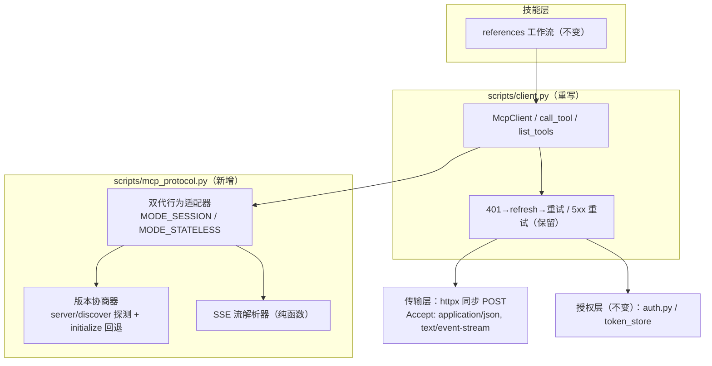

# 技能内置 MCP Client 完整实现 - 方案设计

> **实现状态**: ✅ 已实施并验证通过（2026-09-21，详见 §十 实施记录；交付物 `scripts/client.py` / `mcp_protocol.py` / `protocol_selfcheck.py` 均在库）
> **最后更新**: 2026-09-23（原头部状态「已确认，待实施」与 §十 矛盾，已修正；文件名曾为 GBK 乱码形态，2026-09-23 已修复）
> 原状态行：已确认，待实施。2026-09-21 四阶段开发流程阶段二产物。阶段一需求分析的关键决策：全版本协商+两代自适应 / 仅 tools 能力 / 不兼容 2024-11-05 老传输 / 代码+技能文档同步交付。
> 规范依据：MCP specification 2025-03-26 / 2025-06-18 / 2025-11-25（会话式）与 2026-07-28（无状态，当前版）；server 侧 mcp SDK 2.2.0（LATEST=2026-07-28，DEFAULT_NEGOTIATED=2025-03-26）。

---

## 一、背景与目标

iwp skill 目前自带一个仅够自用的 MCP client（`scripts/client.py`）：initialize 硬编码 `2024-11-05`、不发 `notifications/initialized`、后续请求缺 `MCP-Protocol-Version` 头、JSON-RPC id 恒为 1、SSE 解析只取第一个 `data:` 行（丢通知/不回应 server ping）、tools/list 无分页、不支持 structuredContent、无 2026-07-28 无状态支持。

目标：实现一个**协议合规、开箱即用**的技能内置 MCP client——不依赖宿主（MiniMax Code/Claude Code/Codex 等）的 MCP client 与任何额外配置，能对任意 MCP server 自适应协商协议版本并正确完成工具调用全生命周期。

**明确不做**（阶段一确认）：
- 不实现 sampling / elicitation / roots / resources / prompts 客户端能力（capabilities 只声明 tools，未声明的能力 server 不会发起）；
- 不兼容 2024-11-05 老 HTTP+SSE 传输（不做双传输探针，遇老 server 报明确错误）；
- 不实现 MRTR（Multi Round-Trip Requests）交互——收到 `input_required` 结果时报明确错误；
- 授权层（auth.py / token_store / OAuth 流程）与 401→refresh、5xx 重试、错误分类出口保持不变。

## 二、规范依据（关键条款）

| 版本 | 关键要求 |
|------|---------|
| 2025-03-26 ~ 2025-11-25（会话式） | initialize（client 发最新版本，server MUST 回同版本或其最新版本；client 不支持 server 响应版本则断开）→ **client MUST 发 notifications/initialized** → 后续请求带 `Mcp-Session-Id` + `MCP-Protocol-Version`（2025-11-25 起 MUST）头；server→client `ping` receiver MUST 回应；会话终止 client SHOULD 发 `DELETE`；GET 流为可选（server 可 405） |
| 2025-06-18 | tools 结构化输出（`structuredContent`/`outputSchema`）；tools/list 分页（`cursor`/`nextCursor`）；JSON-RPC batching 移除 |
| 2026-07-28（无状态） | 无 initialize/握手/会话/GET 流/ping；每请求带 `MCP-Protocol-Version` 头 + `_meta`（`io.modelcontextprotocol/protocolVersion`、`io.modelcontextprotocol/clientInfo`、`io.modelcontextprotocol/clientCapabilities`）；必带头 `Mcp-Method`（全部）与 `Mcp-Name`（tools/call 等）；`server/discover` server MUST 实现并声明 supportedVersions；结果带 `resultType`（缺省视为 `"complete"`）；版本不支持返回 -32022 `UnsupportedProtocolVersionError`（data.supported 列表）；tools/list 带 `ttlMs`/`cacheScope` 缓存提示 |

## 三、整体架构

## 四、协商决策流（开箱即用核心）

1. 首请求发 `server/discover` 探针（MCP-Protocol-Version: 2026-07-28 + `_meta`）：
   - **成功** → 从 server `supportedVersions` 选最高共同版本：选中 2026-07-28 → 无状态模式；选中会话式版本 → 走 initialize 握手 → 会话模式；
   - **失败**（-32601 / HTTP 404，server 不认识新方法）→ 回退 initialize（提议 2025-11-25）；若响应版本不在 client 支持集，或报 -32602/-32022 且带 `data.supported` → 选最高共同版本重新 initialize；
   - 无共同版本 → `version_mismatch` 明确报错（附双方支持集）。
2. 协商结果按 endpoint 记忆在模块级缓存（client 为一次性实例，避免每次调用重复探测；token 变化不影响协商）。

## 五、双代行为适配

| 行为点 | MODE_SESSION（2025-03-26/06-18/11-25） | MODE_STATELESS（2026-07-28） |
|---|---|---|
| 握手 | initialize → 发 notifications/initialized | 无握手 |
| 请求头 | `Mcp-Session-Id` + `MCP-Protocol-Version` | `MCP-Protocol-Version` + `Mcp-Method` + `Mcp-Name` |
| 请求体 | 常规 params | params._meta：protocolVersion / clientInfo / clientCapabilities |
| server→client 请求 | SSE 流内 `ping` MUST 立即回 `{}`；未声明能力请求回 -32601 | ping 已废除；`input_required` 结果报明确错误 |
| 结果解析 | `content[0].text` JSON 优先，`structuredContent` 兜底（§七修正）；`isError` 先判 | 同左；`resultType` 缺失视为 `"complete"` |
| tools/list | cursor 分页循环取全 | 同左；`ttlMs` 透传不缓存 |
| 会话终止 | `__exit__` 发 DELETE（SHOULD，静默容错） | 无 |
| GET 流/订阅 | 不开（client MAY；405 不影响） | 已废除 |

## 六、关键逻辑

1. **JSON-RPC id**：`itertools.count(1)` 实例级递增；server→client 请求用其自带 id 原样回应，与 client 请求 id 空间隔离。
2. **SSE 解析器**（纯函数）：解析 `event:`/多行 `data:`/事件边界，输出消息列表；兼容单行 data 的现有情形。
3. **版本协商器**（纯函数）：client 支持集 `[2026-07-28, 2025-11-25, 2025-06-18, 2025-03-26]`；输入 server 响应（版本/错误），输出 (mode, version) 或明确失败。
4. **错误体系**：沿用 `McpToolError` 分类；新增 `version_mismatch`；`-32022/-32602` 的 `data.supported` 参与协商。
5. **公开 API 不变**：`call_tool(name, arguments)` / `list_tools()` / `McpClient` 上下文管理器签名不动，全部工作流零改动。

## 七、边界情况

| 场景 | 处理方式 |
|------|---------|
| server 版本协商彻底失败 | `version_mismatch` 错误附双方支持集 |
| SSE 流中途断连 | 请求失败重发（新请求新 id），连接类错误由现有重试覆盖 |
| structuredContent 与 content 并存 | 优先 structuredContent；isError 判定在解析之前 |
| 探测请求 401 | 走现有 refresh 链后重试探测 |
| 每次调用重复探测 | 模块级协商缓存（endpoint→mode/version） |
| discover 成功但选会话式版本 | 正常走 initialize（server 可同时支持两代） |
| x-mcp-header 工具参数映射（2026-07-28） | IWP 工具不使用；本期不实现，遇到时透传报错 |

## 八、涉及文件清单

| 文件 | 修改类型 | 说明 |
|------|---------|------|
| `scripts/client.py` | 重写 | 双代行为适配器；保留 401/5xx/错误分类与公开 API |
| `scripts/mcp_protocol.py` | 新增 | 协议常量、版本协商器、SSE 解析器（纯函数可测） |
| `scripts/protocol_selfcheck.py` | 新增 | 自检 CLI：对目标 endpoint 输出协商结果/版本/工具数，开箱诊断 |
| `skill_config.py` | 修改 | 支持版本列表、client name/version 常量 |
| `SKILL.md` | 修改 | 调用约定补"协议自适应"；按 writing-great-skills 规范同步 |
| `references/_shared/tool-discovery.md` | 修改 | 分页/structuredContent/协议自适应说明 |
| `references/_shared/failure-modes.md` | 修改 | 新增 version_mismatch 等错误码翻译 |
| `docs/architecture.md` | 修改 | 新增 ADR：协议自适应双代 client 决策 |
| mcp 仓库 `docs/mcp/MCP-OAuth-后续安全改造规划.md` | 修改 | T3-2 关闭回写（本任务覆盖其全部范围） |

## 九、验证标准（阶段四依据）

1. 对当前 IWP MCP server（SDK 2.2.0）：协商落点与会话式行为正确（initialize/initialized/会话头/DELETE），17 工具全量调用成功；
2. 协议合规项逐条核验：notifications/initialized、MCP-Protocol-Version 头、id 递增、ping 应答、SSE 多事件、分页、structuredContent、resultType 容错；
3. 纯函数（协商器/SSE 解析）单元断言通过；
4. `protocol_selfcheck.py` 对真实 endpoint 输出诊断报告；
5. SKILL.md/references 与 writing-great-skills 规范一致；T3-2 关闭回写完成。

## 十、实施记录（2026-09-21）

**状态：已实施并验证通过。**

- 交付：`scripts/client.py`（重写）、`scripts/mcp_protocol.py`（新增）、`scripts/protocol_selfcheck.py`（新增）、`scripts/test_mcp_protocol_asserts.py`（纯函数断言）、`skill_config.py`（协议常量）、SKILL.md 与 references/_shared 两份文档同步、architecture.md ADR-011、mcp 仓库 T3-2 关闭回写。
- 验证：py_compile 通过；纯函数 7 组断言全过（SSE 多事件/跨行 data/单行兼容/id 匹配/协商/supported 提取/method_not_recognized）；真实 endpoint 冒烟 PASS（协商落点 session/2025-11-25、17 工具分页合并、跨分支只读工具 list_my_tasks / list_subjects / get_current_work_week 全通、双实例独立会话）。

**对原方案的一处修正（§五/§七）**：结果解析从"structuredContent 优先"改为 **content 文本优先、structuredContent 兜底**。原因：SDK 2.x 对"返回 JSON 字符串"的工具生成 `structuredContent = {"result": "<json 字符串>"}` 包装壳，直接采用会把工作流依赖的返回形状从内层 JSON dict 变成包装壳（实测 `list_subjects` 返回 `{"result": "..."}` 而非 `{"total": 21, ...}`）。content 优先保证历史返回形状零回归；structuredContent 仅在 content 缺失时兜底，并对该包装壳解包。
