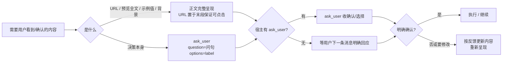

# 用户交互呈现统一 - 方案设计

> **实现状态**: ✅ 已实现（2026-09-23）
> **文档角色**: 历史增量方案（与《写操作完整预览-方案设计》《事前检查与配置引导-方案设计》并列，不覆盖不改写既有文档）

## 一、背景与问题

2026-09-23 真机会话（mvs_d6d20b3）在「任务 162 写操作预览」环节，把 15 行字段表 + 约 600 字描述全文塞进 `ask_user` 的 question 字段，观感差。根因链：

1. 2026-09-22 设计写操作完整预览时，把老教训「短值放 description 会被 UI 隐藏」过度泛化为「全部内容放 question」，落进 `write-preview.md:66` 与设计文档硬性规则 7
2. 2026-09-23 Agent Memory 已修正为按长度分流规则，但技能文件未同步——过时版是运行时被读取的"唯一事实来源"，正确记忆竞争失败
3. 全技能 7 处运行时指令位各自表述呈现方式，4 处代码运行时文本硬编码 `ask_user` 工具名，无一处考虑无 ask_user 宿主

writing-great-skills 视角：single source of truth 被违反（同一规则三处并存且版本不一）、sediment（旧层沉淀）、分支缺失（无宿主兜底）。

## 二、设计目标

技能中所有「需要用户查看 / 确认 / 提供输入」的环节，呈现行为统一为一条规则：**内容全走正文，question 只承载问句与选项，确认门槛不因工具缺席而降低**。

用户明确口径（2026-09-23 确认）：

- question 只承载问句与选项，其余一切内容（URL、预览全文、示例值、背景说明）一律回复正文
- **URL 一律不进 question，在正文呈现**——保证可点击跳转

## 三、核心规则（user-interaction.md 内容骨架）

| 规则 | 内容 |
|------|------|
| R-内容 | 必看内容先以回复正文完整呈现；question 只写问句，options 只写 label；URL 一律正文（可点击），不进 question 与 description |
| R-兜底 | 宿主有 ask_user 用它收集确认；没有则等用户下一条消息明确回应。工具可缺席，确认门槛不可降 |
| R-判据 | 呈现完成判据可检验：①必看内容已完整出现在正文；②question 不含 URL/表格/多行/超一句内容；③写入/授权已获用户明确回应 |
| R-接入 | 各流程只定义"何时必须问"（co-location），"如何呈现"一律指向 `references/_shared/user-interaction.md` |

## 四、信息流

## 五、落点

| 文件 | 类型 | 内容 |
|------|------|------|
| `references/_shared/user-interaction.md` | 新增 | 呈现机制唯一事实来源（R-内容/R-兜底/R-判据/R-接入 + 接入表） |
| `references/_shared/write-preview.md` | 修改 | §5 删「预览全文放 question」错误规则，呈现环节指向新规范；确认循环逻辑留原地 |
| `references/_shared/auth-flow.md` | 修改 | 第 2 步改「URL 以回复正文展示（可点击）+ 询问是否完成授权」，删否定式 |
| `references/_shared/setup-flow.md` | 修改 | 询问 URL 步骤：示例值移正文，提问只问 URL；指向新规范 |
| `references/_shared/failure-modes.md` | 修改 | 两处授权 URL 呈现改正文表述 + 指针 |
| `references/tasks/README.md` | 修改 | W4 多候选：正文列候选 + 指针 |
| `SKILL.md` | 修改 | 调用约定区与相关文档区各加一行指针 |
| `scripts/auth.py` / `cli.py` / `scripts/preflight.py` | 修改 | RuntimeError / hint / help / 注释宿主中立化，不再点名 ask_user |
| `docs/写操作完整预览-方案设计.md` | 修改 | 硬性规则 7 处加勘误注（覆盖规则 7 与流程图③），其余不动 |

范围外：CLI 行为、OAuth 逻辑、工具契约、metadata.version、自然语言询问场景（tasks-README 缺省值询问、reports-README 素材询问）、其余历史 docs。

## 六、风险与缓解

| # | 风险 | 缓解 |
|---|------|------|
| R1 | 正文内容在 ask_user 弹出时被 UI 折叠 | URL/预览置于正文末段紧邻提问；真机验证可见可点击，若仍折叠回退调整呈现顺序 |
| R2 | RuntimeError 新文案与 auth-flow 指针不同步 | 一致性 grep + 真机未授权态实测 |
| R3 | 安装副本需 push + update 才生效 | 交付时说明，不在本任务处理 |

## 七、验证口径

1. 一致性：grep 全仓确认运行时文件无「question 正文 / 预览全文放 question / 用 ask_user 展示」残留；新规范被 SKILL.md + 5 个指令位指针触达
2. 编译：三个脚本 py_compile 通过
3. 真机：auth start 未授权态 → RuntimeError 新文案且不含 ask_user 字样 → 正文 URL 可见可点击
4. 验收：阶段四逐项对照本方案核验

## 八、勘误（2026-09-23，实现阶段审查发现）

首轮实现时，多个落点在指针旁复述了规则内容（「以回复正文展示」「可点击跳转」「question 只写问句」等），违反单一事实来源——同一含义两处住，规则演进时需两处编辑，与本次事故根因同型。已按 writing-great-skills 收敛：**各落点只保留"动作（what）+ 指针"，how 一律以 `user-interaction.md` 为唯一来源**（auth-flow 第 2 步、write-preview §5 第 1 条、setup-flow 第 2 步、failure-modes 两处、tasks-README W4、auth.py/cli.py 运行时文本、user-interaction.md §4 接入表删"呈现方式"列）。SKILL.md 指针标签与 user-interaction.md 完成判据经审查判定为可接受（前者描述管辖范围，后者是规则的可检验形态）。
